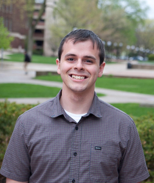

## About Me
A driven and passionate scientist with a strong foundation in chemistry, data science, algorithms, and machine learning. I excel at employing creative solutions to complex problems while maintaining a focus on both team and individual success. My objective is to bridge the gap between chemistry and computer science to solve real world problems.  

Interests:
- [Computers](notes/Computers.md)
- [Mentorship](notes/Mentorship.md)
- [Motorcycling](notes/Motorcycling.md)
- [Machine-Learning](notes/Machine-Learning.md)

## Education
Computational Chemist  
- Stanford Science Fellow (postdoc) in Martinez Lab (2020-Present)  
- Stanford Artificial Intelligence Professional Certificate
- PhD in Chemistry from University of Michigan in Zimmerman Lab (2015-2020)  
- B.S. in Chemistry from the University of New Mexico  

## Recent News
- Invited Seminar at IBM Zurich on Graph Theoretical Methods to Predict Molecular Reactions and Mechanisms  
- Invited talk for Synthesis Supergroup at Stanford -> [Slides]()   (TODO)
- Invited talk at World Association of Theoretical Chemistry (WATOC2020)  
- Attended [RL Summer School](https://rlsummerschool.com) at Vrjie University in Amsterdam 
- [Featured in Los Altos Town Crier for Mentorship](https://www.losaltosonline.com/schools/science-learning-institute-offers-internships-with-pathway-to-stem/article_8056c754-b564-11ec-ad82-4b544bbeb2ef.html)

## Current Projects
- [🔗Reaction Template Studio🔗](https://mtzgroup.github.io/retropaths/)
    - [▶️ Video ▶️](https://youtu.be/L-8zXFInrOc)
- NMR Transformers 
- Photocycloaddition of Tethered Arene Alkenes

## Published Research
- Elisa Pieri, Dean Lahana, Alexander M. Chang, Cody R. Aldaz, Keiran Thompson, and Todd Martinez, The non-adiabatic nanoreactor: towards the automated discovery of photochemistry, Chemical Science 2021
- Cody Aldaz, Ted Wiley, Nicholas A. Miller, Kenneth G. Spears, Nawodi Abeyrathna, Yi Liao, Paul Zimmerman, Roseanne Sension, Experimental and theoretical characterization of ultrafast water-soluble photochromic photoacids The Journal of Physical Chemistry B 2021, 125, 16, 4120–4131
- Cody Aldaz, Todd Martinez, Paul Zimmerman, The Mechanics of Bicycle Pedal Photoisomerization in Crystalline Cis,Cis-1,4-diphenyl-1,3-butadiene, The Journal Of Physical Chemistry A, 2020, 124, 8897−8906
- Cody Aldaz, Ted Wiley, Nicholas A. Miller, Kenneth G. Spears, Nawodi Abeyrathna, Yi Liao, Paul Zimmerman, Roseanne Sension, Experimental and theoretical characterization of ultrafast water-soluble photochromic photoacids The Journal of Physical Chemistry B 2021, 125, 16, 4120–4131
- Cody Aldaz, Josh Kammeraad, Paul Zimmerman. Discovery of conical intersection mediated photochemistry with growing string methods. Physical Chemistry Chemical Physics, 20, 27394-27405, 2018
- Jian Gao, Alan K. Thomas, Jianzhong Yang, Cody Aldaz, Guoshun Yang, Yang Qin, John K. Grey Polythienylene-vinylene Structure-Function Correlations Revealed from Resonance Raman Spectroscopy and Photocurrent Imaging. The Journal of Physical Chemistry C., vol. 119, 8980, 2015

